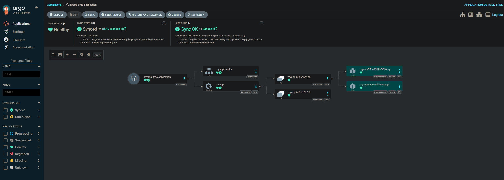

# 🚀 ArgoCD GitOps Deployment with GitHub

This project demonstrates how to use **ArgoCD** to deploy Kubernetes resources using the **GitOps** methodology — syncing a GitHub repository with a Kubernetes cluster.

## 📖 Overview

- Deploy Kubernetes manifests from a GitHub repository using ArgoCD
- Automatically apply changes made in GitHub to the Kubernetes cluster
- Use declarative infrastructure stored under version control
- Self-healing and auto-pruning via ArgoCD sync policy

Commands 

# install ArgoCD in k8s
kubectl create namespace argocd
kubectl apply -n argocd -f https://raw.githubusercontent.com/argoproj/argo-cd/stable/manifests/install.yaml

# access ArgoCD UI
kubectl get svc -n argocd
kubectl port-forward svc/argocd-server 8080:443 -n argocd

# login with admin user and below token (as in documentation):
kubectl -n argocd get secret argocd-initial-admin-secret -o jsonpath="{.data.password}" | base64 --decode && echo

# you can change and delete init password
